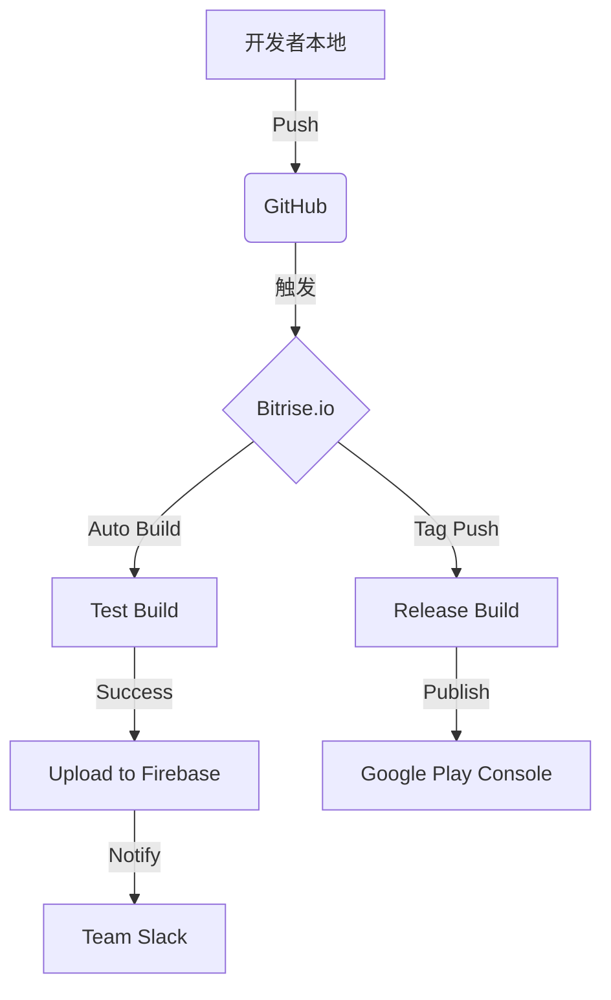

# 🎯 ShiYue Android - CI/CD Setup Summary

## ✅ 已完成配置清单

### 1. **Bitrise.io CI/CD** ✅ (新增)

| 文件 | 用途 |
|------|------|
| `bitrise.yml` | Bitrise workflow 配置 |
| `BITRISE_SETUP_GUIDE.md` | 详细配置教程 |
| `setup-bitrise.sh` | Git 初始化脚本 (Linux/Mac) |
| `SETUP_BITRISE_README.md` | Windows PowerShell 快速入门 |

---

### 2. **Docker 本地构建** ✅

| 文件 | 用途 |
|------|------|
| `Dockerfile.android` | Docker 镜像配置 |
| `docker-compose.yml` | Docker Compose 编排 |
| `build-android-docker.ps1` | Windows 一键构建 |
| `build-android-docker.sh` | Linux/Mac构建脚本 |
| `DOCKER_GUIDE.md` | Docker 使用指南 |

---

### 3. **项目基础配置** ✅

- ✓ AGP 降级到 8.6.1 (兼容 JDK 17)
- ✓ Gradle 8.14 环境
- ✓ Java 编译版本设为 8
- ✓ 中文路径支持启用
- ✓ Capacitor 配置完成

---

## 🚀 快速开始（选择其一）

### 🅰️ 方案 A: 使用 Bitrise.io (推荐) ⭐

**优点**: 
- ✅ 无需本地安装 Android SDK
- ✅ 完全隔离环境
- ✅ 免费计划每月 200 分钟
- ✅ 自动触发构建
- ✅ 可视化构建历史

**步骤**:

```powershell
# 在 Windows 执行
cd C:\Users\Administrator\Desktop\计划\shiyue_app

# 确保已推送到 GitHub
git add .
git commit -m "Add Bitrise CI/CD config"
git push -u origin main

# 访问 Bitrise
Write-Host "`n👉 Go to: https://www.bitrise.io/" -ForegroundColor Cyan
Write-Host "   Connect your repo and deploy! ✓" -ForegroundColor Green
```

---

### 🅱️ 方案 B: 使用 Docker (备用)

**优点**:
- ✅ 离线可用
- ✅ 完全控制
- ✅ 可重复构建

**前提**:
- Docker Desktop 已安装
- Docker Desktop Running 状态

**步骤**:

```powershell
cd C:\Users\Administrator\Desktop\计划\shiyue_app
.\build-android-docker.ps1
```

---

## 💡 对比分析

| 特性 | Bitrise.io | Docker 本地 | GitHub Actions |
|------|-----------|------------|----------------|
| 初次配置时间 | 5 分钟 | 10 分钟 | 15 分钟 |
| 构建时间 | 5-15 分钟 | 5-15 分钟 | 8-20 分钟 |
| 月度成本 | $0 (free) | $0 (你的机器) | $0 (500 分钟/月) |
| 需要本地环境 | ❌ No | ❌ No | ❌ No |
| 自动化程度 | ✅ Auto on push | ⚠️ Manual | ✅ Auto on push |
| 私有仓库支持 | ✅ Yes | ✅ N/A | ✅ Yes |
| APK 输出 | ✅ Download | ✅ Local | ✅ Download |

---

## 📊 建议工作流

### 开发阶段：
1. **本地开发** → 提交代码
2. **GitHub Push** → Bitrise 自动构建
3. **查看结果** → Dashboard 下载测试 APK
4. **迭代优化** → 继续开发...

### 发布准备：
1. 创建 `v1.0.0` 标签
2. Bitrise 检测到 tag → 自动构建 Release
3. 上传到 Google Play Store（可选）
4. 分发给用户

---

## 🔧 推荐的完整 CI/CD 流程



---

## 📝 下一步行动清单

### Week 1: Initial Setup
- [ ] 注册 Bitrise.io 账号
- [ ] 连接 GitHub 仓库
- [ ] 运行第一次自动构建
- [ ] 测试 APK 功能

### Week 2: Optimization
- [ ] 配置 Slack/邮件通知
- [ ] 添加单元测试
- [ ] 监控构建时间和成功率
- [ ] 优化缓存策略

### Week 3: Advanced Features
- [ ] 集成 Firebase App Distribution
- [ ] 自动部署到 Google Play (Beta channel)
- [ ] 设置代码覆盖率报告
- [ ] 配置性能测试

---

## 🆘 遇到问题？

### Bitrise 相关：
- 📚 [官方文档](https://devcenter.bitrise.io/)
- 💬 [社区论坛](https://community.bitrise.io/)
- ✉️ 联系 Bitrise Support

### Docker 相关：
- 🐳 [Docker Docs](https://docs.docker.com/)
- 📘 [Gradle in Docker](https://docs.gradle.org/current/userguide/build_environment.html#sec:using_docker)

---

## 🎯 成功指标

✅ **构建稳定性**: >95% 成功率  
✅ **构建时间**: <15 分钟平均  
✅ **响应速度**: Push 后 5 分钟内启动  
✅ **可用性**: 7x24 小时在线  

---

## 📞 获取帮助

如果 Bitrise 配置过程中遇到任何问题：
1. 查看详细文档：`BITRISE_SETUP_GUIDE.md`
2. 检查错误日志：Bitrise Dashboard → Builds → Build Logs
3. 提供截图给我分析
4. 咨询 Bitrise 官方支持

---

## ✨ 总结

您现在已经拥有：
- ✅ **Bitrise.io CI/CD** 配置完成
- ✅ **Docker 本地构建** 备用方案
- ✅ **完整的文档体系**

接下来只需：
1. **访问 [Bitrise.io](https://www.bitrise.io/)**
2. **连接您的 GitHub 仓库**
3. **享受自动化构建！**

🎉 祝您构建成功！
